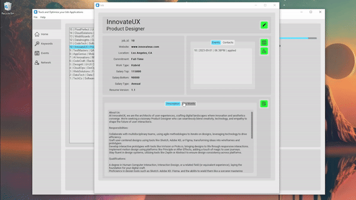
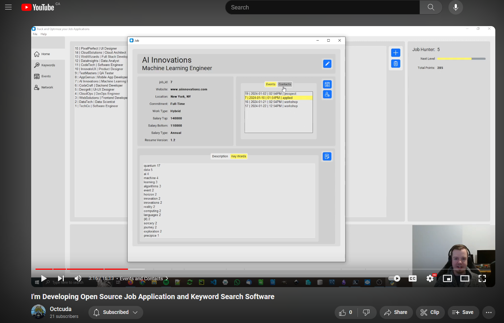
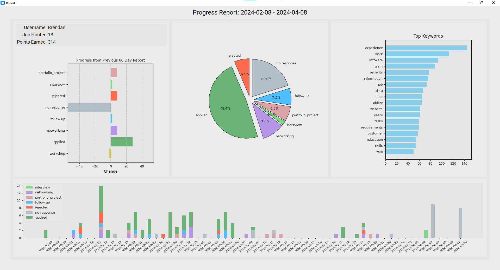
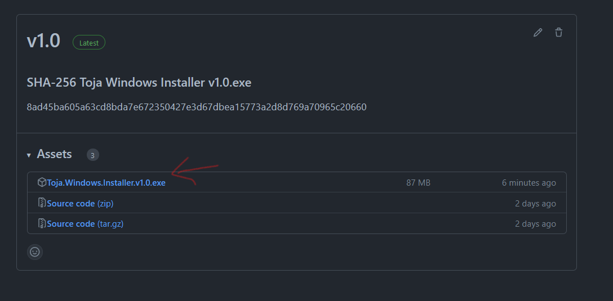
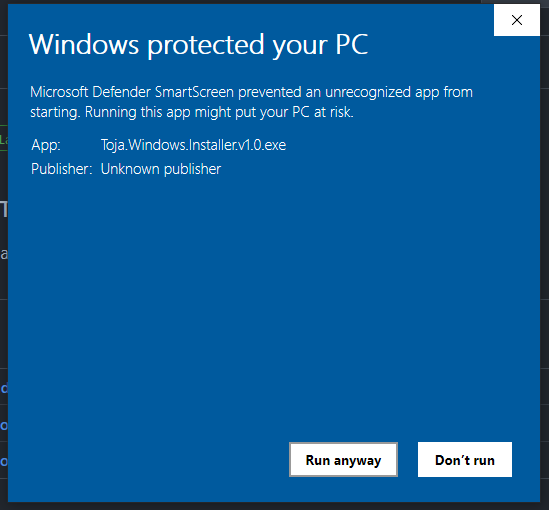
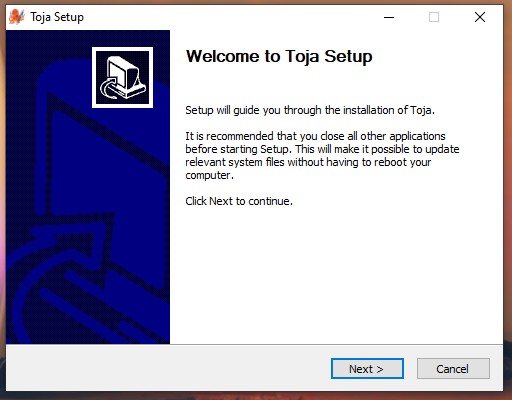

# TOJA
### A Desktop Program to Track &amp; Optimize your Job Applications.
 

 

## Why use TOJA?
🌟 Effortless Organization:  Keep track of all your job prospects effortlessly with Toja. Stay grounded, focused, and motivated throughout your job search journey.

🧠 Personalized Insights:  Utilizing Natural Language Processing (NLP), Toja helps you search, find, and rank keywords in your job database. Make informed decisions with personalized data insights.

📄 Resume Optimization:  Upload your resume and receive a unique score, guiding you to enhance your ATS (Applicant Tracking System) score for better visibility.

🚀 Stay Motivated:  Earn points and level up with each step closer to landing your dream job. Toja keeps you motivated throughout your job search process.

🔒 Data Privacy:  Rest assured, all your information is stored locally on your machine, ensuring utmost privacy and security.

🛡️ Enhanced Security:  Protect yourself from phishing attempts or false job listings by referencing your Toja prospects list.

📝 Activity Logging:  Generate visual progress reports and export your data at any time, giving you complete control over your job hunting activity.

🤖 Automation:  Save time and focus on your prospects by setting automatic close dates for inactive prospects.

🌐 Open Source:  Toja is open-source software, promoting transparency and collaboration within the community.

🚫 No Paywalls:  Enjoy the full functionality of Toja without any hidden costs or paywalls. It's completely free to use!

### Watch Video Overview 

## Description

### Job Profile
+ Easily add, view and edit job prospect by creating a Job Profile
  + A Job Profile displays relevant information about each job
 

 

### Generate Progress Reports
+ Generate Visual Progress Reports
  + Select any date range 
  + Compare progress to previous date range
  + Top Keywords
  + Event Breakdown and Log   
 

 

### Keywords
+ Use natural language processing to find in-demand skills.
+ Customize your Search
  + Scan all jobs
  + Scan single job
  + Scan by position title.
    + Use the threshold slider to include or isolate desired jobs.  100 threshold will only include exact matches, while decreasing the threshold will include all jobs with similar titles (ie. Data Scientist, Data Engineer)
+ Upload your Resume
  + Discover your unique resume score
  + Gain insights and improve your resume         
 

 

### Events
+ Keep track of all your past and upcoming events
+ Earn points with each new event and level up as a Job Hunter. 

### Network
+ Add contacts and grow your Network.
+ Link your contacts to Events or Job prospects to keep more organized  

## Installation

### Option A) Download Windows Installer
1. Navigate to the <a href = "https://github.com/BAndresen/TOJA/releases">Releases</a> section of this repository and download and run the Toja.Windows.Installer.v1.0.exe.
 

 

2. This is a small project and I didn't purchase a Windows publishers certificate.  You will likey be prompted about an unkown application and need to Run Away.
+ Use SHA-256 Hash for optional additional verifcation of download
 

 

3. Complete the setup wizard
+ Choose if you would like a Desktop and/or Start Menu shortcut.
+ Toja is designed to run on the local user and saved to the USER/AppData/Local/ directory.
+ When done with Toja, included is an uninstaller found in the 'add and remove' section of the control panel. 
 

 
 

### Option B) Clone Repository and run Source Code

1. Download Git
https://git-scm.com/downloads

2. Download Python
https://www.python.org/downloads

*ensure python.exe added to PATH*

 

3. Open terminal and navigate to desired file directory for program
4. Use following terminal command to clone repository
`git clone https://github.com/BAndresen/TOJA.git`
5. From terminal navigate into new TOJA directory `cd` command on windows `>>> cd toja`
6. Use following terminal command to install dependencies
`pip install -r requirements.txt`
OR optionally create a virtual environment
  + `python -m venv venv`
  + `venv\Scripts\activate`
  + `pip install -r requirements.txt`

7. Open Toja application using the terminal. While in TOJA directory use command `python toja`
  + *If using a virtual environment you need to activate each time* `venv\Scripts\activate`

