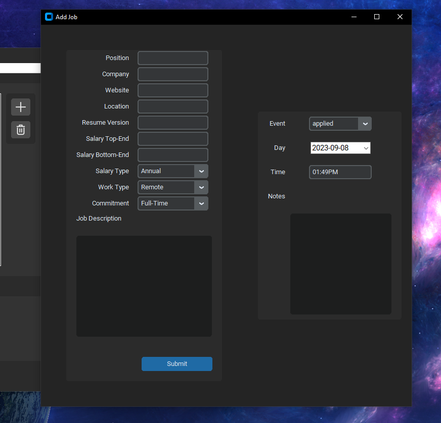

# TOJA
### Track &amp; Optimize your Job Applications.

<div align="center">

</div>
<br>

## Why use TOJA?
+ Make the job hunting process more organized, analytical and motivational.
+ Own your Data! None of your Job Data is shared. Everything is stored locally on your machine
+ Open Source
+ 100% Free! No Paywalls for additional Features.


## Description
### Submit Job Information
Easily add details about a new job prospect or application
<br>
<div align="center">

</div>
<br>

### Job Profile 
View and edit current job info
<br>
<div align="center">

</div>
<br>

### Network
Add contacts and grow your Network.  
<div align="center">

</div>
<br>

### Events 
Keep track of all your past and upcoming Events 
<br>
<div align="center">

</div>
<br>

### Level Up
Get that extra boost. Earn points with each new event and level up.  

### Export
Showcase how organized you are. Export all your data in csv.

*All user data shown is fake sample data*

<div align="center">

</div>
<br>

### Upcoming Features
+ Visual Graphs integrated in UI
+ Keyword Search

### Install

Requirements.txt
```
customtkinter==5.2.0
darkdetect==0.8.0
tkcalendar~=1.6.1
Pillow~=10.0.0
Faker==19.4.0  # Used for testing
```


