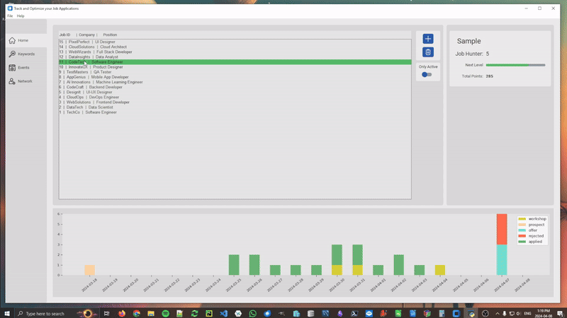

# TOJA
### A Desktop Program to Track &amp; Optimize your Job Applications.
Getting a Job is Hard. Download Toja to help you Succeed
 

 

## Why use TOJA?
+ Make the job hunting process more organized, analytical and motivational.
+ Own your data! Nothing is shared and everything is stored locally on your machine
+ Open Source
+ No Paywalls

## Description
+ Easily add, view and edit job prospect by creating a Job Profile
  + A Job Profile displays relevant information about each job
 

 

### Keywords
+ Use natural language processing to find in-demand skills.
+ Customize your Search
  + Scan all jobs
  + Scan single job
  + Scan by position title.
    + Use the threshold slider to include or isolate desired jobs.  100 threshold will only include exact matches, while decreasing the threshold will include all jobs with similar titles (ie. Data Scientist, Data Engineer)
+ Upload your Resume
  + Discover your unique resume score
  + Gain insights and improve your resume         
 

 

### Events
+ Keep track of all your past and upcoming events
+ Earn points with each new event and level up as a Job Hunter. 
 

 

### Network
+ Add contacts and grow your Network.  

 

### Export
Export your data anytime.

*All user data shown is fake sample data*

 

## Installation

### Option A) Download Windows Installer
1. Navigate to the <a href = "https://github.com/BAndresen/TOJA/releases">Releases</a> section of this repository and download and run the Toja.Windows.Installer.v1.0.exe.
 

 

2. This is a small project and I didn't purchase a Windows publishers certificate.  You will likey be prompted about an unkown application and need to Run Away.
+ Use SHA-256 Hash for optional additional verifcation of download
 

 

3. Complete the setup wizard
+ Choose if you would like a Desktop and/or Start Menu shortcut.
+ Toja is designed to run on the local user and saved to the USER/AppData/Local/ directory.
+ When done with Toja, included is an uninstaller found in the 'add and remove' section of the control panel. 
 

 
 

### Option B) Clone Repository and run Source Code

1. Download Git
https://git-scm.com/downloads

2. Download Python
https://www.python.org/downloads

*ensure python.exe added to PATH*

 

3. Open terminal and navigate to desired file directory for program
4. Use following terminal command to clone repository
`git clone https://github.com/BAndresen/TOJA.git`
5. From terminal navigate into new TOJA directory `cd` command on windows `>>> cd toja`
6. Use following terminal command to install dependencies
`pip install -r requirements.txt`
OR optionally create a virtual environment
  + `python -m venv venv`
  + `venv\Scripts\activate`
  + `pip install -r requirements.txt`

7. Open Toja application using the terminal. While in TOJA directory use command `python toja`
  + *If using a virtual environment you need to activate each time* `venv\Scripts\activate`

