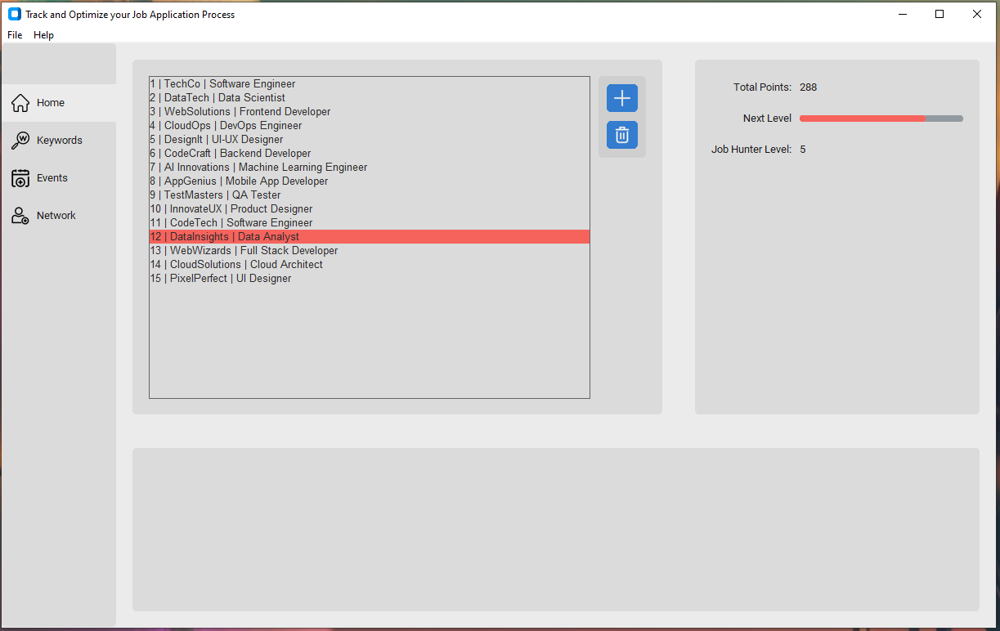

# TOJA
Track &amp; Optimize your Job Applications. Make the job hunting process more organized, analytical and modivational.

 

 

## Why use TOJA?
+ Own your Data! None of your Job Data is shared. Everything is stored locally on your machine
+ Open Source
+ 100% Free! No Paywalls for additional Features.

## Description
### Submit Job Information
Easily add details about a new job prospects or applications
 

 

### Job Profile Viewer 
View current job descriptions, events or contacts for each job
 

 

### Earn Points and Level Up
Get that extra boost. Earn points with each new event and level up.  

### Export
Want to showcase how organized you are at looking for a job? Export all your data in csv.

 

### Upcoming Features
+ Visual Graphs integrated in UI
+ Keyword Search

