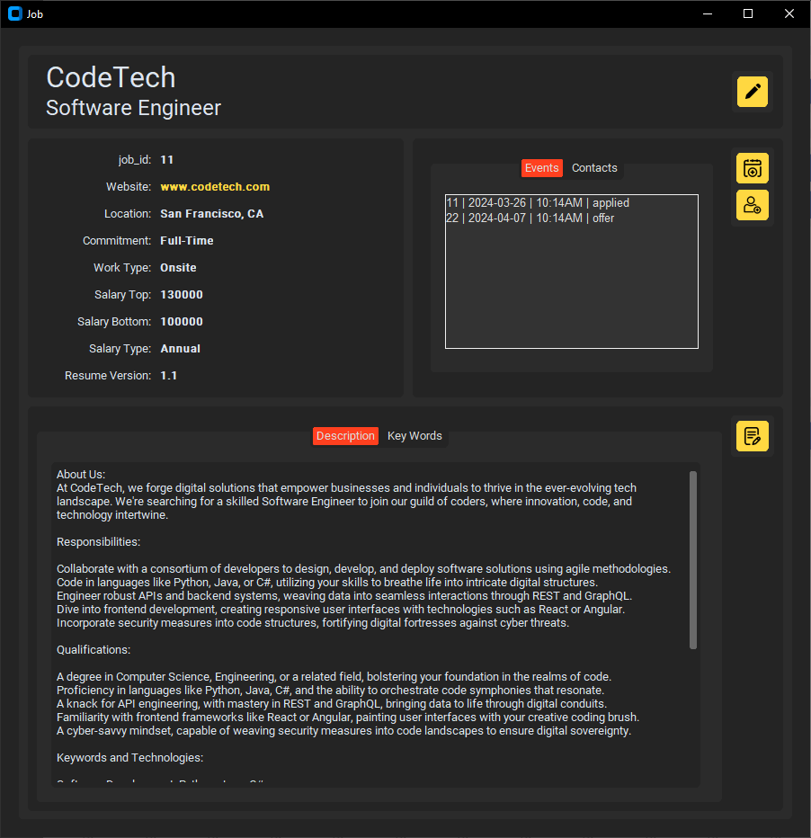

# TOJA
### A Desktop Application to Track &amp; Optimize your Job Applications.

 

## Why use TOJA?
+ Make the job hunting process more organized, analytical and motivational.
+ Own your Data! Nothing is shared and everything is stored locally on your machine
+ Open Source
+ No Paywalls

## Description
### Submit Job Information
Easily add details about a new job prospect or application
 

 

### Job Profile 
View and edit current job info
 

 

### Network
Add contacts and grow your Network.  

 

### Events 
Keep track of all your past and upcoming Events 
 

 

### Keyword Search
Use natural language processing to search keywords in your job database. Scan all jobs or narrow down your search by job title or individual job.  Additionally, you can upload and search your resume for a thorough comparison.  
 

 

### Level Up
Get that extra boost. Earn points with each new event and level up.  

### Export
Export all your data at anytime in csv.

*All user data shown is fake sample data*

 

### Upcoming Features
+ Visual Graphs integrated in UI

## Installation 

**Option A** Clone Repository and Run with Python

1. Download Git
https://git-scm.com/downloads

2. Download Python
https://www.python.org/downloads

*ensure python.exe added to PATH*

 

3. Open terminal and navigate to desired file directory for program
4. Use following terminal command to clone repository
`git clone https://github.com/BAndresen/TOJA.git`
5. From terminal navigate into new TOJA directory `cd` command on windows `>>> cd toja`
6. Use following terminal command to install dependencies
`pip install -r requirements.txt`
OR optionally create a virtual environment
  + `python -m venv venv`
  + `venv\Scripts\activate`
  + `pip install -r requirements.txt`

7. Open Toja application using the terminal. While in TOJA directory use command `python toja/toja_app.py`
  + *If using a virtual environment you need to activate each time* `venv\Scripts\activate`

