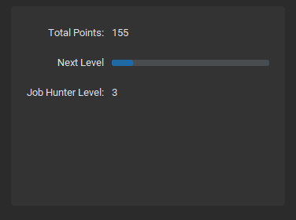

# TOJA
Track &amp; Optimize your Job Application process

 

 

## Overview
With the large amount of opportunities available online when applying for jobs the task can become overwhelming.
TOJA (Track, Optimize, Job Applications) is designed to help users make the process more organized and analytical.
Doing so can help to gain insights into effective strategies as well maintain a positive mental attitude throughout the process.

## Description
### Submit Job Information
Add details about a new job prospect or application
 

 

### Job Profile Viewer 
Add addtional Job Information, Descriptions Events or Contacts
 

 

### Earn Points and Level Up
Earn points with each new event
 

 

### _Development Notes_
_TOJA is still in the early stages of development and has limit features.  I hope to improve shortly_

### Upcoming Features
+ Update job application Status
+ Set application submission goals 
+ Generate reports on job application analytics
  + Parse verbose job descriptions to analyse common keywords
  + Ratios:
    + Apply : Interview
    + Apply : Offer
    + Jobs applied : Time (per/day, per/week, per/month)
  + Visual graphs
  + Job platform performance (Linkedin vs Indeed)
  + Resume version metrics (keep track of different resume's performance to compare)
+ Add user interface 

